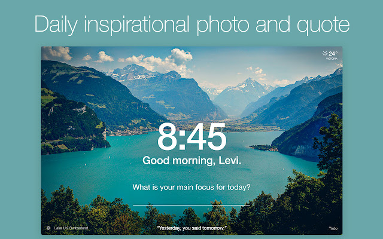
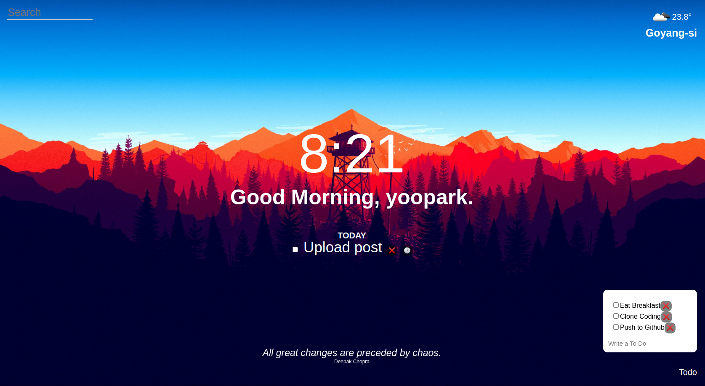

# Momentum이 뭔데?

아는 사람은 아는 생산성 익스텐션이다. 정보의 홍수에 지친 우리네 사람들이 하나에만 집중할 수 있도록, 크롬을 켜면 네이버나 구글이 아니라 아래 페이지로 시작한다.

물론 웹을 잘 알지도 못하는 내가 독창적으로 이걸 클론코딩해보자는 기특한 생각을 하진 않았겠고, 노마드 코더의 [바닐라 JS로 크롬 앱 만들기](https://nomadcoders.co/javascript-for-beginners) 강의에서 하길래 한번 해봤다. 필자는 위 강의에 더하여 구글 검색, 뽀모도로 타이머 기능을 추가했다. [여기](https://yoopark.github.io/nomad-vanila-js)에 배포해두었으니 참고 바란다.

# Features

- localStorage를 활용한 Todo CRUD
- 25분(1뽀모도로) 타이머
- 현재 시각(Date), 현재 날씨(OpenWeatherMap API) 표시
- 랜덤 배경, 랜덤 명언
- 구글에 검색하는 Input

# TIL

## BEM 네이밍 컨벤션

Block-Element-Modifier의 약자로 HTML 클래스명 지을 때 주로 쓴다.

`.block__element--modifier` 형식으로 작성한다.  
예) `contact-form__button-submit--03_disable`

## 시맨틱 태그

SEO 최적화, 웹 접근성 향상, 코드 가독성을 위해 반드시 써야 한다.

## defer

1. head에 그냥 script 추가 : HTML은 파싱 중 마주치는 순서대로 block한 뒤 fetch & execute 하기 때문에 body 위에 하는 건 좋지 않다.
2. body 안 끝 부분에 script 추가 : body를 빨리 볼 수는 있지만 JS 의존이 큰 페이지라면 비정상적으로 작동한다고 느낄 것이다.
3. head에 async : HTML 파싱과 병렬로 fetch한 뒤 execute할 때만 HTML 파싱을 block한다. 하지만 파싱되기도 전에 querySelector 같은게 실행될 수도 있고 먼저 fetch 완료된 것부터 실행되기 때문에 JS 간 실행 순서도 보장할 수 없다.
4. head에 defer : fetch까지는 async와 똑같지만 execute를 파싱 완료 시점으로 지연시키고, JS가 작성된 순서대로 실행시킨다.

## Flexbox

- flex-direction
- justify-contents & align-items
- flex-basis & flex-grow & flex-shrink

## 기타

- localStorage set & get
- setInterval & clearInterval
- fetch (Promise)

# 소감

Momentum 익스텐션이랑 너무 똑같게 만드는데 집중하느라 오히려 창의성이 부족했다. [여기](https://nomadcoders.co/faq/challenge/vanillajs)에 들어가보면, 같은 기능이지만 얼마나 다양한 디자인이 나올 수 있는지 감탄할 수 있다.

팀 개발을 하고 싶지만, 군대라 그럴 수 없어 너무 아쉽다.
