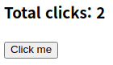

> 노마드코더의 [ReactJS로 영화 웹 서비스 만들기](https://nomadcoders.co/react-for-beginners/lobby) 강좌의 처음 ~ 3.4절 내용을 모티브로 작성하였습니다.

JavaScript로 토이프로젝트를 하나만 해봐도 `document.querySelector`로 요소를 고르고 `innerText` 프로퍼티로 HTML을 수정하는, 아주 불편한 일이 비일비재하게 일어난다는 사실을 체감한다.

이번 글에서 getElementById, createElement, JSX, React Hooks를 차근차근 도입해보면서 Vanila JS에서 React로 코드가 변하는 과정을 살펴보자.

# v1.0 Vanila JS

```html
<!doctype html>
<html>
  <body>
    <h3>Total clicks: 0</h3>
    <button id="btn">Click me</button>

    <script>
      <!-- 하단 참고 -->
    </script>
  </body>
</html>
```

```js
let counter = 0;
const h3 = document.querySelector('h3');
const button = document.getElementById('btn');
function handleClick() {
  counter += 1;
  h3.innerText = `Total clicks: ${counter}`;
}
button.addEventListener('click', handleClick);
```



이미 짐작하셨다시피, 버튼을 누를 때마다 1씩 올라가는 코드다.

# v2.0 createElement

```html
<!doctype html>
<html>
  <body>
    <div id="root"></div>
    <script src="https://unpkg.com/react@17.0.2/umd/react.production.min.js"></script>
    <script src="https://unpkg.com/react-dom@17.0.2/umd/react-dom.production.min.js"></script>
    <script>
      <!-- 하단에 참고 -->
    </script>
  </body>
</html>
```

react와 react-dom 스크립트를 추가했다.

```js
let counter = 0;
const root = document.getElementById('root');
const h3 = React.createElement('h3', null, 'Total clicks: 0');

function handleClick() {
  counter += 1;
  const h3 = React.createElement('h3', null, `Total clicks: ${counter}`);
  const container = React.createElement('div', null, h3, btn);
  ReactDOM.render(container, root);
}

const btn = React.createElement(
  'button',
  {
    id: 'btn',
    onClick: handleClick,
  },
  'Click me',
);

const container = React.createElement('div', null, h3, btn);
ReactDOM.render(container, root);
```

### 이전 버전과의 차이점은?

HTML에는 `div#root` 밖에 없다. CSR의 기미가 슬슬 보인다.

1. `React.createElement()`로 요소를 만든다.
2. `ReactDOM.render()`로 렌더링한다.

- 참고 : `createElement(type, props, ...children)` 프로토타입 [링크](https://react.dev/reference/react/createElement)

---

# v3.0 JSX

```html
<!doctype html>
<html>
  <body>
    <div id="root"></div>

    <script src="https://unpkg.com/react@17.0.2/umd/react.production.min.js"></script>
    <script src="https://unpkg.com/react-dom@17.0.2/umd/react-dom.production.min.js"></script>
    <script src="https://unpkg.com/@babel/standalone/babel.min.js"></script>
    <script type="text/babel">
      <!-- 하단 참고 -->
    </script>
  </body>
</html>
```

babel 스크립트를 추가했다.

```jsx
let counter = 0;
const root = document.getElementById('root');

function handleClick() {
  counter += 1;
  const H3 = () => <h3>Total Clicks: {counter}</h3>;
  const Container = () => (
    <div>
      <H3 /> <Button />
    </div>
  );
  ReactDOM.render(<Container />, root);
}

const H3 = () => <h3>Total Clicks: 0</h3>;

const Button = () => (
  <button id="btn" onClick={handleClick}>
    Click me
  </button>
);

const Container = () => (
  <div>
    <H3 /> <Button />
  </div>
);
ReactDOM.render(<Container />, root);
```

### 이전 버전과의 차이점은?

JS 대신 JSX를 사용하였다.  
JSX는 SCSS처럼 트랜스컴파일(Source-to-Source Compile)이 필요한데, 그 트랜스컴파일러가 babel이다.

> ❗️ 컴포넌트명은 반드시 capitalize여야 한다. 그렇지 않으면 babel이 일반 HTML 요소로 인식한다.

```jsx
'use strict';

H3 = () => /*#__PURE__*/ React.createElement('h3', null);
h3 = () => /*#__PURE__*/ React.createElement('h3', null);

const Container = () =>
  /*#__PURE__*/ React.createElement(
    'div',
    null,
    /*#__PURE__*/ React.createElement(H3, null),
    ' ',
    /*#__PURE__*/ React.createElement('h3', null),
  );
```

재미있게도 v2.0의 코드가 바로 babel에서 트랜스컴파일한 결과와 같다.

# v3.1 더 JSX스럽게!

이제부터 HTML은 똑같다. (react, react-dom, babel, div#root)

```jsx
let counter = 0;
const root = document.getElementById('root');

function render() {
  ReactDOM.render(<Container />, root);
}

function countUp() {
  counter += 1;
  render();
}

const Container = () => (
  <div>
    <h3>Total clicks: {counter}</h3>
    <button onClick={countUp}>Click me</button>
  </div>
);

render();
```

### 이전 버전과의 차이점은?

1. H3, Button 컴포넌트가 재사용성이 없다고 판단하여 삭제했다.
2. 클릭 시마다 새로운 Container 컴포넌트를 매번 정의하지 않아 리소스를 아낀다. (이전까지 새로 Container를 정의할 수밖에 없었던 이유는 초기 innerText 값을 단순히 `Total Clicks: 0`이라는 쌩 문자열로 할당해버렸기 때문이다.)
3. `ReactDOM.render(<Container />, root);` 이 중복되기 때문에 render라는 함수로 감쌌다.

---

# v4.0 useState

```jsx
function App() {
  let [counter, setCounter] = React.useState(0);
  const onClick = () => {
    setCounter(counter + 1);
  };
  return (
    <>
      <h3>Total clicks: {counter}</h3>
      <button onClick={onClick}>Click me</button>
    </>
  );
}

const root = document.getElementById('root');
ReactDOM.render(<App />, root);
```

### 이전 버전과의 차이점은?

1. 기존 사용하던 counter와 counterUp 대신 useState를 이용하여 깔끔해졌다.
2. Container라는 이름을 App으로 rename
3. useState를 이용하면 매번 렌더링해주지 않아도 상태 변화 시 자동으로 렌더링한다. 따라서 render 함수는 필요없어졌다. 마지막에 ReactDOM.render 한번만 해주면 된다.
4. 의미없는 div 대신 Fragment 사용

# v4.1 setCounter 함수형으로 변환

```jsx
function App() {
  let [counter, setCounter] = React.useState(0);
  const onClick = () => {
    /* setCounter(counter+1); */
    setCounter((current) => current + 1);
  };
  return (
    <>
      <h3>Total clicks: {counter}</h3>
      <button onClick={onClick}>Click me</button>
    </>
  );
}
```

setCounter를 실행하자마자 counter로 바로 반영되는 것이 아니라 render 호출 시점까지 지연되기 때문에 unsafe하다.

```jsx
const onClick = () => {
  // counter=100
  setCounter(counter + 1);
  console.log(counter); // 100
  setCounter(counter + 1);
  console.log(counter); // 100
}; // render() 이후에는 counter=101
```

이 상황을 두고 useState가 비동기적이라 부른다.

```jsx
const onClick = () => {
  // counter=100
  setCounter((counter) => counter + 1); // re-render
  console.log(counter); // 101
  setCounter((counter) => counter + 1); // re-render
  console.log(counter); // 102
}; // render() 이후에도 counter=102 유지.
```

함수적 갱신을 사용하자.
