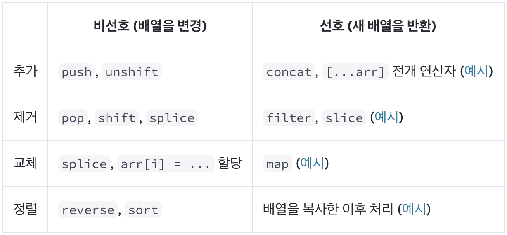

[patterns.dev.kr - Design Patterns](https://patterns-dev-kr.github.io/#design-patterns)

> 위 링크의 Design Patterns 파트 내용을 정독 후 작성하였습니다. 해당 내용은 Vanila JavaScript 이용 개발 시 발생하는 패턴에 대한 설명이기 때문에 React 패턴과는 다소 차이가 있어 연관성이 전혀 없는 부분은 자체 삭제하였습니다. 원본 [patterns.dev](https://www.patterns.dev/)에서는 사이트를 리뉴얼하여 Vanila JavaScript 패턴과 React 패턴을 나누어 설명하고 있으니 궁금하신 분들은 직접 들어가서 살펴보시길 추천드립니다.

# Singleton 패턴

> 앱 전체에서 공유 및 사용되는 단일 인스턴스

- 장점 : 메모리 절약
- 단점 : 전역 상태이므로 관리에 주의

ex. axios client 생성

```tsx
import axios from 'axios';

class AxiosClient {
  private static instance: AxiosClient;

  private constructor() {}

  public static getInstance(): AxiosClient {
    if (!AxiosClient.instance) {
      AxiosClient.instance = new AxiosClient();
    }
    return AxiosClient.instance;
  }

  public async get<T>(url: string): Promise<T> {
    const response = await axios.get<T>(url);
    return response.data;
  }

  public async post<T, R>(url: string, data: T): Promise<R> {
    const response = await axios.post<R>(url, data);
    return response.data;
  }
}

const axiosClient = AxiosClient.getInstance();

export default axiosClient;
```

React에선 전역 상태 관리를 위해 Singleton 객체를 만드는 것 대신 **Redux**나 **React Context**를 자주 사용한다. Singleton과 유사해 보이지만 Singleton은 인스턴스의 값을 직접 수정할 수 있는 반면에, 언급한 도구들은 **읽기 전용 상태**를 제공한다. Redux를 사용할 땐 오직 컴포넌트에서 디스패쳐를 통해 넘긴 액션에 대해 실행된 순수함수 리듀서를 통해서만 상태를 업데이트할 수 있다.

# Proxy 패턴

> 대상 객체에 대하여 읽기 및 쓰기를 직접 제어한다

*패턴*이라기보다는 `new Proxy(...)` 라고 JavaScript에서 지원하는 기능이다.

[Proxy - JavaScript | MDN](https://developer.mozilla.org/en-US/docs/Web/JavaScript/Reference/Global_Objects/Proxy)

객체에 대한 getter, setter를 wrap해준다.

```tsx
const person = {
  name: 'John Doe',
  age: 42,
  nationality: 'American',
};

const personProxy = new Proxy(person, {
  get: (obj, prop) => {
    console.log(`The value of ${prop} is ${obj[prop]}`);
  },
  set: (obj, prop, value) => {
    console.log(`Changed ${prop} from ${obj[prop]} to ${value}`);
    obj[prop] = value;
    return true;
  },
});

personProxy.name; // The value of name is John Doe
personProxy.age = 43; // Changed age from 42 to 43
```

ex. Immer

use-immer 라이브러리를 활용하면 `...` 전개를 생략할 수 있다.

```tsx
export default function Form() {
  const [person, setPerson] = useState({
    name: 'Niki de Saint Phalle',
    artwork: {
      title: 'Blue Nana',
      city: 'Hamburg',
      image: 'https://i.imgur.com/Sd1AgUOm.jpg',
    }
  });

	function handleTitleChange(e) {
    setPerson({
      ...person,
      artwork: {
        ...person.artwork,
        title: e.target.value
      }
    });
  }
  ...
```

```tsx
import { useImmer } from 'use-immer';

export default function Form() {
  const [person, updatePerson] = useImmer({
    name: 'Niki de Saint Phalle',
    artwork: {
      title: 'Blue Nana',
      city: 'Hamburg',
      image: 'https://i.imgur.com/Sd1AgUOm.jpg',
    }
  });

	function handleTitleChange(e) {
    updatePerson(draft => {
      draft.artwork.title = e.target.value;
    });
  }
  ...
```

다중 전개까지 커버해주다니… 엄청나다.

Immer는 [Proxy](https://developer.mozilla.org/en-US/docs/Web/JavaScript/Reference/Global_Objects/Proxy) 객체 타입으로 구현되었다고 한다.



Immer를 사용하면, 좌측의 비선호 연산을 사용하더라도 우측의 선호 연산으로 변경된다.

# Provider 패턴

> 여러 자식 컴포넌트에서 데이터를 사용가능하게 한다

- 장점 : prop-drilling 불편함 해결
- 단점 : 컨텍스트를 참조하는 모든 컴포넌트(와 재귀적 변경으로 인한 하위 컴포넌트)는 컨텍스트 변경시마다 모두 리렌더링되므로 성능 이슈

ex. `~Provider` Wrapper (styled-components의 `ThemeProvider` 등)

ex. React Context

# Prototype 패턴

> 동일 타입의 여러 객체들이 프로퍼티를 공유한다

패턴이라기보다는 **상속** 느낌으로 JavaScript에서 지원하는 기능이다.

[Object prototypes - Web 개발 학습하기 | MDN](https://developer.mozilla.org/ko/docs/Learn/JavaScript/Objects/Object_prototypes)

Q. JavaScript를 설명할 때 주로 프로토타입 기반 언어라고 프로토타입 설명에 공을 들이는데, 정작 React에서 prototype을 만지는 경우가 없는 듯하다.

# Container/Presentational 패턴

> 비즈니스 로직으로부터 뷰를 분리하여 SoC를 강제한다

- SoC(Seperation of Concerns) : 관심사 분리

대개 Container/Presentational 패턴은 React Hooks로 대체 가능하다. 별도 컴포넌트로 분리하는 것 뿐만 아니라, custom hook을 이용하는 등 **로직과 뷰를 구분하기만 하면 모두 Container/Presentational 패턴**이라고 할 수 있다.

- 장점 : 정말 많다.
  - Presentational 컴포넌트는 재사용에 매우 용이, 디자인 시스템의 토대
  - Presentational 컴포넌트는 앱의 비즈니스 로직을 수정하지 않으므로 코드베이스에 대한 이해가 깊지 않은 개발자더라도 쉽게 수정 가능
  - Presentational 컴포넌트는 대개 순수함수이므로 테스트하기 쉽다. 전체 mock 데이터 로직을 만들필요 없이 storybook처럼 인자만 넘겨주면 된다.
- 단점 : 없음 (~~관심사 분리에 단점이 어딨겠습니까~~ 과하면 오버엔지니어링..?)

```tsx
export default function useDogImages() {
  const [dogs, setDogs] = useState([]);

  useEffect(() => {
    fetch('https://dog.ceo/api/breed/labrador/images/random/6')
      .then((res) => res.json())
      .then(({ message }) => setDogs(message));
  }, []);

  return dogs;
}
```

# Observer 패턴

> Observable을 이용해 Subscriber에게 이벤트 발생을 알린다

Observable 객체는 이벤트 모니터링의 역할을 갖고. Observer는 받은 데이터를 처리하는 역할을 갖게 된다.

ex. 특정 이벤트 발생 시 `logger`, `toastify` 동시에 호출

[설명 영상 링크](https://patterns-dev-kr.github.io/design-observer01.mp4)

```tsx
import { ToastContainer, toast } from 'react-toastify';

function logger(data) {
  console.log(`${Date.now()} ${data}`);
}

function toastify(data) {
  toast(data);
}

observable.subscribe(logger);
observable.subscribe(toastify);

export default function App() {
  function handleClick() {
    observable.notify('User clicked button!');
  }

  function handleToggle() {
    observable.notify('User toggled switch!');
  }

  return (
    <div className="App">
      <Button>Click me!</Button>
      <FormControlLabel control={<Switch />} />
      <ToastContainer />
    </div>
  );
}
```

Observable을 직접 구현할 수도 있고, RxJS를 사용하면 import하여 사용할 수 있다.

```jsx
class Observable {
  constructor() {
    this.observers = [];
  }

  subscribe(func) {
    this.observers.push(func);
  }

  unsubscribe(func) {
    this.observers = this.observers.filter((observer) => observer !== func);
  }

  notify(data) {
    this.observers.forEach((observer) => observer(data));
  }
}
```

Q. 보아하니 요새는 React에서 RxJS를 잘 안 쓰는 것 같은데… Angular에서는 잘 쓰는 듯하다. _왜?_

[Angular.kr, 'Angular 가이드'](https://angular.kr/guide/observables)

Q. Observable이 Promise의 상위호환이라는데, 글을 읽어도 잘 와닿지 않는다.

ex. GraphQL Apollo client의 `fromPromise`

- 상황 설명 : 401 에러가 반환되면 새로운 access token을 서버에 요청한 뒤 다시 요청을 보내는 response interceptor를 제작해야 함.
- GraphQL의 onError 함수는 반환값으로 Observable을 받기 때문에 `fromPromise`를 사용하여 Promise → Observable로 변환

[Velog, @yj05037, 'refreshToken'](https://velog.io/@yj05037/1212-refreshToken)

```tsx
import { fromPromise } from '@apollo/client';
import { onError } from '@apollo/client/link/error';

const errorLink = onError(({ graphQLErrors, operation, forward }) => {
  const oldHeaders = operation.getContext().headers;

  if (graphQLErrors) {
    for (const error of graphQLErrors) {
      switch (error.extensions.status) {
        case 401:
          return fromPromise(
            getNewAccessToken(getRefreshToken() ?? ''),
          ).flatMap((newAccessToken) => {
            operation.setContext({
              headers: {
                ...oldHeaders,
                authorization: `Bearer ${newAccessToken}`,
              },
            });
            return forward(operation);
          });
      }
    }
  }
});
```

[코드 링크](https://github.com/42Statistics/42Stat-Frontend/blob/6cc3b65d6d49b2585df98d6f6b765616d6427a59/app/src/@core/providers/ApolloProvider.tsx#L39-L60)

# Module 패턴

> 코드를 재사용 가능하면서도 작게 나눈다

import, export, default export, dynamic import …

# Mixin 패턴 (deprecated)

> 상속 없이 객체에 기능을 추가한다

React 개발팀은 [mixin을 사용하지 말아 주세요](https://reactjs.org/blog/2016/07/13/mixins-considered-harmful.html). 라는 글과 함께 컴포넌트의 믹스인이 복잡도를 증가시키고 재사용하기 어렵게 만든다고 이야기했다. 대신 React 개발팀은 지금은 훅에 의해 대체 가능하지만 [고차 컴포넌트를 사용하길 권장](https://www.notion.so/d410bf6197b0441c998535a58f5bd30d?pvs=21)했었다.

ex. 객체의 병합. shallow merge(Object.assign), deep merge(lodash.merge)

# HOC 패턴 (deprecated)

> 앱 전반적으로 재사용 가능한 로직을 prop으로 컴포넌트에게 제공한다

- 장점 : 횡단 관심사를 묶을 수 있음
- 단점 : HOC가 중첩되면 어디서 온 건지 찾아다니기가 힘들다.

**HOC는 복잡성, 가독성, 재사용성의 측면에서 어려움이 있기 때문에 사용이 줄어들었으며, 대안으로 Hooks, Render Props, Composition 패턴을 사용한다.**

ex. 데이터 fetch 로직(loading, error 등)을 처리하는 withLoader HOC

```jsx
export default function withLoader(Component, url) {
  return (props) => {
    const [data, setData] = useState();
    const [loading, setLoading] = useState(false);

    const fetchData = useCallback(async () => {
      setLoading(true);
      setData(await ApiService.get(url));
      setLoading(false);
    }, []);

    useEffect(() => {
      fetchData();
    }, [fetchData]);

    if (loading) {
      return <div style={{ fontSize: '200px' }}>Loading...</div>;
    }
    return <Component {...props} data={data} fetchData={fetchData} />;
  };
}
```

```tsx
function Todos({ data, fetchData }) {
  return (
    <section style={{ marginTop: '20px' }}>
      <button onClick={fetchData}>Refecth Data</button>
      <ul>{data?.map((todo) => <Todo key={todo.id} todo={todo} />)}</ul>
    </section>
  );
}

export default withLoader(Todos, 'todos');
```

ex. fetch 로직 분리의 예 (withLoader의 대안..?)

[React Router 공식문서, 'Feature Overview v6.15.0'](https://reactrouter.com/en/main/start/overview#data-loading)

React Router v6.4부터 컴포넌트 렌더링 전 데이터를 가져오는 `loader` prop이 도입되었다.

# Render Props 패턴

> JSX 엘리먼트를 prop을 통해 컴포넌트에게 전달한다

`children` prop도 render prop 패턴에 해당한다.

- 장점 1 : 함수의 인자에서 명시적으로 prop이 전달되기 때문에 HOC를 사용할 때 prop이 모호한 문제가 해결된다. 이 때문에 prop이 어디로부터 오는지 확실히 알 수 있다.
- 장점 2 : `children` prop은 **엄밀히 말해 하위 컴포넌트가 아니라 prop에 컴포넌트를 넘겨준 것이므로, 부모 컴포넌트가 리렌더링되더라도 재귀적 리렌더링의 영향을 받지 않아 렌더링 최적화에 도움이 된다.**

ex. 예전 apollo client의 mutation

```tsx
<Mutation mutation={FIRST_MUTATION}>
  {(firstMutation) => (
    <Mutation mutation={SECOND_MUTATION}>
      {(secondMutation) => (
        <Mutation mutation={THIRD_MUTATION}>
          {(thirdMutation) => (
            <Element
              firstMutation={firstMutation}
              secondMutation={secondMutation}
              thirdMutation={thirdMutation}
            />
          )}
        </Mutation>
      )}
    </Mutation>
  )}
</Mutation>
```

예전에는 useMutation 대신 이렇게 썼다고 한다… 이런 사용은 hook으로 대체되었다.

ex. fetch state(loading, error, data)를 render props 패턴으로 처리하기

```tsx
function Fetch({ url, renderSuccess, loadingFallback, renderError }) {
  const { loading, error, data } = useFetch(url);

  if (loading) {
   return loadingFallback;
  }
  if (error) {
    return renderError(error);
  }
  if (data) {
    return renderSuccess({ data });
  }
}

export default Component() {
  return (
    <Fetch
      url={`https://api.github.com/users/${login}`}
      loadingFallback={<Spinner />}
      renderError={error => (
        <FetchError message={error.message} />
      )}
      renderSuccess={({ data }) => (
				<ChildComponent data={data} />
      )}
    />
  );
}
```

# Hooks 패턴

> 앱 전체에서 함수를 통해 상태를 가진 로직을 여러 컴포넌트들에서 사용한다

⚠️ _보기 더러울 때 일단 뭉쳐두는_ 방식의 사용은 커스텀 훅의 대표적인 안티패턴이다.

[토스ㅣSLASH 21 - 실무에서 바로 쓰는 Frontend Clean Code](https://www.youtube.com/watch?v=edWbHp_k_9Y&t=470s)

Q. 어떻게 하면 Custom Hook 패턴을 잘 쓸 수 있을까?

# Compound 패턴

> 하나의 작업을 위해 여러 컴포넌트를 만들어 역할을 분담하게 한다

UI 라이브러리들에는 좋은 Compound Component들이 많다.

[shadcn/ui, 'Dialog'](https://ui.shadcn.com/docs/components/dialog)

[Chakra UI, 'Modal'](https://chakra-ui.com/docs/components/modal)

```tsx
import {
  Modal,
  ModalBody,
  ModalCloseButton,
  ModalContent,
  ModalFooter,
  ModalHeader,
  ModalOverlay,
} from '@chakra-ui/react';

function BasicUsage() {
  const { isOpen, onOpen, onClose } = useDisclosure();
  return (
    <>
      <Button onClick={onOpen}>Open Modal</Button>

      <Modal isOpen={isOpen} onClose={onClose}>
        <ModalOverlay />
        <ModalContent>
          <ModalHeader>Modal Title</ModalHeader>
          <ModalCloseButton />
          <ModalBody>
            <Lorem count={2} />
          </ModalBody>

          <ModalFooter>
            <Button colorScheme="blue" mr={3} onClick={onClose}>
              Close
            </Button>
            <Button variant="ghost">Secondary Action</Button>
          </ModalFooter>
        </ModalContent>
      </Modal>
    </>
  );
}
```

이런 유형의 코드를 의미한다.

[jbee.io, '변경에 유연한 컴포넌트'](https://jbee.io/web/components-should-be-flexible/#2-역할이-드러나는-네이밍)

위 아티클에서 `right`라는 이름의 prop을 사용하여 **변경에 유연한 컴포넌트**를 제작하였다고 소개한 바 있다.


하지만 굳이 “오른쪽”에 있어야 할 이유가 딱히 없다면, compound 패턴을 활용하여 배치를 더 유연하게 만들 수 있다.

- 장점 : UI 변경에 유연함, 필요한 prop을 서브 컴포넌트(ex. Modal.Footer)로 바로 넘겨주면 되기 때문에 prop drilling을 줄일 수 있음(자식 간에 공통으로 필요한 prop은 메인 컴포넌트에서 context를 사용하면 된다)
- 단점 : 너무 유연해서 정해진 사용법을 벗어나 마음대로 사용하였을 때 UI가 굉장히 이상해질 수 있음.

UI가 너무 유연해진다는 단점을 막기 위해 메인 컴포넌트에서 **children을 읽어 해당 서브 컴포넌트 타입에 해당하는 것을 모은 뒤 재배치하는 기법을 사용하기도 한다.**

[합성 컴포넌트로 재사용성 극대화하기 | 카카오엔터테인먼트 FE 기술블로그](https://fe-developers.kakaoent.com/2022/220731-composition-component/#3-2-메인-컴포넌트-구현)

```tsx
const DialogLabelButtonType = (<DialogLabelButton />).type;
function getDialogLabelButtons(children: ReactNode) {
  const childrenArray = Children.toArray(children);
  return childrenArray
    .filter(
      (child) => isValidElement(child) && child.type === DialogLabelButtonType,
    )
    .slice(0, 2);
}

interface DialogMainProps {
  children?: ReactNode;
  isOpen: boolean;
}

function DialogMain({ children, isOpen }: DialogMainProps) {
  if (!isOpen) {
    return null;
  }
  const dialogContents = getDialogContents(children);
  const dialogLabelButtons = getDialogLabelButtons(children);
  const dialogDimmed = getDialogDimmed(children);

  return createPortal(
    <div>
      <div>{getDialogDimmed(children)}</div>
      {dialogContents && <div>{dialogContents}</div>}
      {dialogLabelButtons && <div>{dialogLabelButtons}</div>}
    </div>,
    document.body,
  );
}
```
